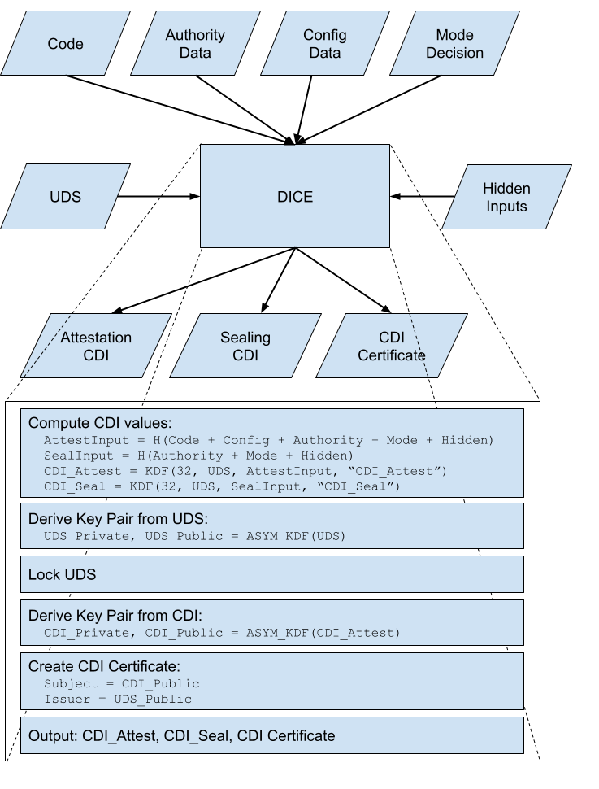
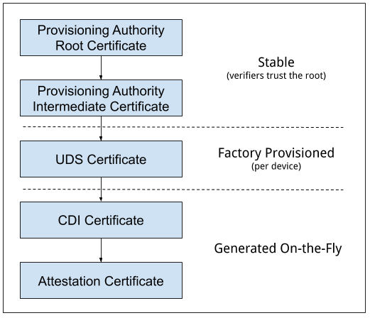
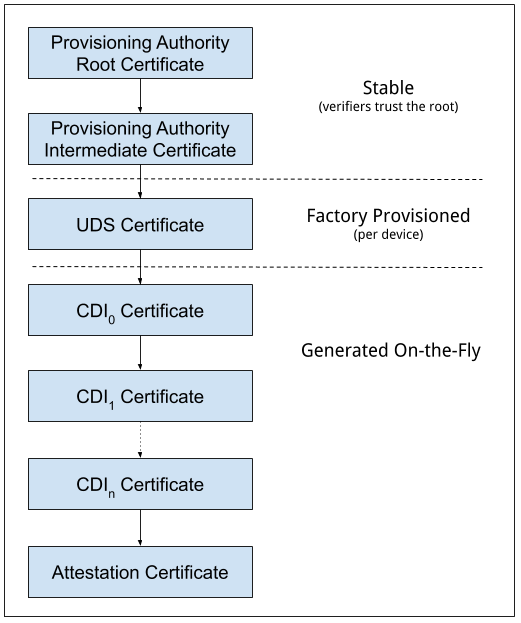

# Open Profile for DICE

v2.5

[TOC]

## Background

The Trusted Computing Group (TCG) specifies
[Hardware Requirements for a Device Identifier Composition Engine](https://trustedcomputinggroup.org/wp-content/uploads/Hardware-Requirements-for-Device-Identifier-Composition-Engine-r78_For-Publication.pdf)
(DICE) which provides the context for this document. We'll call this TCG
document the *TCG DICE specification*. Concepts like a Unique Device Secret
(UDS) and a Compound Device Identifier (CDI) are used as defined in the TCG DICE
specification.

#### A Note on Nomenclature

This document uses the term *hardware* to refer to anything that is immutable by
design after manufacturing. Code in mask ROM, for example, is *hardware*. The
terms *firmware*, *software* and *program* are all interchangeable; they all
refer to mutable code. Often we say *firmware* for code that runs early in boot,
and *program* for a particular unit of code, but it's really all *software*.

#### DICE Primer

For those not familiar with DICE, here is a quick primer on the concepts:

*   **UDS** - Unique Device Secret. This is a per-device hardware-level secret
    accessible to the DICE but not accessible after the DICE runs. This is one
    of the DICE inputs. Note that when [layering](#layering-details) DICE
    computations the UDS is only used for the first computation when
    transitioning from hardware to software. Mutable software must never have
    access to the hardware UDS.
*   **CDI** - Compound Device Identifier. This value represents the
    hardware/software combination measured by the DICE. This is the DICE output
    and is passed to the software which has been measured. This is a secret.
*   **DICE** - Device Identifier Composition Engine. This is a process which
    mixes the UDS with software hashes and other inputs to produce a CDI and
    locks down further access to the UDS. This computation occurs at the point
    of transition from hardware (e.g. ROM) to software (e.g. first bootloader),
    but we can perform the same computation at the point of transition from one
    program to another in general to extend CDIs throughout a system.

DICE can be implemented with a simple HMAC with the UDS as the key, attributes
of the target code or system as the input, and the output is the CDI. However,
for a particular implementation there are questions that need to be addressed
such as "what is in the input, exactly?", and "how should we use the CDI once we
have it?". That's where this profile comes in, it fills in many of these
details.

## Overview

This document specifies a DICE profile suitable for use in a variety of products
and platforms. The [TCG DICE specification](#background) intentionally allows
for flexibility in implementation; this document specifies many of these
implementation details. This document also fills in various details the TCG DICE
specification considers out of scope. In particular, this document specifies:

*   Cryptographic mechanisms
*   UDS size and provisioning
*   DICE input details, including how DICE interacts with verified boot
*   Additional requirements, including asymmetric key derivation and
    certification

#### Goals

The main goals of this document are:

*   Make it **easier to implement** DICE well, with quality and confidence.
*   **Consistency for DICE implementers**, whether in hardware, firmware, or
    software.
*   **Consistency for attestation verifiers**. There will always be some details
    in the certificate extensions that are specific to the target system, but
    those differences can be minimized by adopting some conventions when
    generating the certificates.

#### Non-Goals

This document is not intended to:

*   Be a formal standard
*   Limit the use of DICE-style mechanisms not described here

## Architecture Diagram

This architecture diagram shows the first DICE transition from hardware to
software, and uses the UDS in the derivation of both the Attestation CDI and
Sealing CDI. Subsequent DICE transitions would use the current CDI values in
place of the UDS to compute the subsequent CDI values. See
[Layering Details](#layering-details). See the [Cryptography](#cryptography)
section for details on the primitives referenced in the diagram.



## Use Cases

This design is motivated by two use cases: **attestation** and **sealing**.
*Attestation* allows a computing device or program to provide verifiable
evidence of its identity and operating state, including hardware identity,
software image, security-relevant configuration, operating environment, etc.
*Sealing* allows a computing device or program to encrypt data in such a way
that it can only be decrypted by the same device or program operating in the
same state as at the time of encryption.

With this design, sealing only works well in combination with some kind of
verified boot system. For a more sophisticated example of sealing key
generation, see
[Appendix C: Versioned Sealing Keys](#appendix-c-versioned-sealing-keys).

# Profile Design

## Input Values

For attestation, DICE inputs should represent all security-relevant properties
of the target program. The target program is the program to which control will
be passed, along with DICE outputs, after the DICE computations are complete.
This profile defines the following types of input, each of which is represented
by a fixed length value:

1.  **Code (64 bytes)** - This input is computed by hashing the target code.
    This is the traditional input described most clearly in the
    [TCG DICE specification](#background). If a software image is too large to
    load and hash entirely, then a descriptor of the code (like the root hash of
    a hash tree) may be used instead. Note that this approach requires
    additional ongoing enforcement to verify pages as they are loaded. A
    canonical example of this is
    [dm-verity](https://source.android.com/security/verifiedboot/dm-verity).
2.  **Configuration Data (64 bytes)** - This input is a catch-all for any
    security-relevant configuration or environment properties that characterize
    the integrity of the system and can be used by an external party to validate
    its identity and/or its operating state. This may capture verified boot
    authority selection, device mode, boot location, chip status information,
    instance identifiers, etc. This value may or may not be a hash of the actual
    configuration data. When it is a hash, the original data must also be
    included in certificates. It's ok for this input to be *not stable*, it may
    change from one boot to the next.
3.  **Authority Data (64 bytes)** - This input is computed by hashing a
    representation of the verified boot trusted authority. For example, this may
    be a public key, a hash of a public key, or a hash of a descriptor
    containing a set of public keys. For many SoCs, this representation of the
    trusted authority is programmed into one-time-programmable (OTP) memory. If
    a code authorization mechanism is disabled or not supported, this input
    should be 64 zero bytes. If multiple public keys are supported with runtime
    selection, this input value must represent all of them. (This is so the
    value remains stable across a key change, the actual key that was used
    during boot should be included in the configuration data input value). The
    authority input value is designed to be stable, it is very unlikely to
    change during a device lifecycle.
4.  **Mode Decision (1 byte)** - This input value is a single-byte mode value.
    Valid mode values are: **0**: Not Configured, **1**: Normal, **2**: Debug,
    **3**: Recovery. The mode is determined at runtime based on the other
    inputs, and only the other inputs. This input is designed to capture a
    configuration signal in a stable way, and to reflect important decisions a
    device makes at runtime. In the sealing use case, this enables data to be
    sealed separately under each mode. See
    [Mode Value Details](#mode-value-details).
5.  **Hidden Inputs (64 bytes)** - This optional input value is *hidden* in the
    sense that it does not appear in any certificate. It is used for both
    attestation and sealing CDI derivation so it is expected to be stable; it
    should not change under normal operation except when that change is an
    intentional part of the device lifecycle. If not used, this value should be
    all zero bytes. While this value can be anything, intended use cases
    include:

    *   Mixing in an additional secret which may be changed as part of the
        device lifecycle, for example ownership transfer
    *   Mixing in a rotation nonce or counter to control the rotation of
        attestation keys and sealing keys
    *   Mixing in stable instance IDs or other internal IDs which may provide
        differentiation for sealing CDIs
    *   Mixing in stable configuration inputs which appear in Configuration Data
        but also should be used in the sealing CDI derivation

## CDI Values

The [TCG DICE specification](#background) refers to a single CDI, but this
profile defines multiple CDIs with different characteristics which can be used
for different use cases:

1.  **Attestation CDI** - This CDI is derived from the combination of all input
    values and will change across software updates or configuration changes.
    This CDI is appropriate for attestation and is *mandatory* for
    implementations of this profile.
2.  **Sealing CDI** - This CDI is derived from only the authority data, mode
    decision, and hidden inputs because these are stable. It will reflect this
    stability and will remain the same across software updates and some
    configuration changes. This CDI is appropriate for sealing and is *optional*
    for implementations of this profile.

### CDI Certificates

This profile requires the generation of a CDI certificate as part of the DICE
flow. The subject key pair is derived from the Attestation CDI value for the
target code. The authority key pair which signs the certificate is derived from
the UDS or, after the initial hardware to software transition, from the
Attestation CDI value for the current code (see
[Layering Details](#layering-details)). The DICE flow outputs the CDI values and
the generated certificate; the private key associated with the certificate may
be optionally passed along with the CDI values to avoid the need for
re-derivation by the target code. The UDS-derived public key is certified by an
external authority during manufacturing to complete the certificate chain. See
[Certificate Details](#certificate-details).

As an example, if the CDI private key were used to sign a leaf certificate for
an attestation key, the certificate chain may look like this:



## High-level DICE Flow

The [TCG DICE specification](#background) outlines a four stage flow: measure,
compute CDI, lock UDS, and transfer control. This profile expands on this to
include operations for CDI certification. The expanded flow has the following
steps:

1.  Measure CDI input values and compute CDI values
2.  Derive an asymmetric key pair from the UDS
3.  Lock UDS
4.  Derive an asymmetric key pair from the Attestation CDI
5.  Generate a CDI certificate
6.  Destroy the UDS-derived private key from step (2)
7.  Transfer control to the target code, passing on the certificate and all CDI
    values

## Cryptography

This profile requires three cryptographic primitives: a hash function, a key
derivation function, and an asymmetric digital signature. The recommended
defaults are [SHA-512](https://en.wikipedia.org/wiki/SHA-2),
[HKDF](https://en.wikipedia.org/wiki/HKDF) (using SHA-512) and
[Ed25519](https://en.wikipedia.org/wiki/EdDSA#Ed25519). Since Ed25519 uses
SHA-512 under the hood, using this combination means implementing only one hash
function. See below for the full list of
[acceptable algorithms](#acceptable-cryptographic-algorithms).

The following pseudocode operations are used throughout this document:

```py
# A hash function. The input can be any length.
hash = H(input)

# Random salt values used as the 'salt' KDF argument (hex encoded).
ASYM_SALT = 63B6A04D2C077FC10F639F21DA793844356CC2B0B441B3A77124035C03F8E1BE
            6035D31F282821A7450A02222AB1B3CFF1679B05AB1CA5D1AFFB789CCD2B0B3B
ID_SALT = DBDBAEBC8020DA9FF0DD5A24C83AA5A54286DFC263031E329B4DA148430659FE
          62CDB5B7E1E00FC680306711EB444AF77209359496FCFF1DB9520BA51C7B29EA

# A KDF operation with the given desired output length, input key material,
# salt, and info.
output = KDF(length, ikm, salt, info)

# An asymmetric key pair derivation, either Ed25519 or ECDSA.
# * The private key is derived using KDF(32, input, ASYM_SALT, "Key Pair").
# * The public key is derived from the private key (per the chosen algorithm).
private_key, public_key = ASYM_KDF(input)
```

### Computing CDI Values

Each CDI value is 32 bytes in length and is computed using a KDF operation with
the UDS or previous CDI value as the input key material argument and the
relevant input measurement as the salt argument. The KDF info argument differs
for each type of CDI.

#### Attestation CDI

The Attestation CDI input measurement is derived from the combination of all
input values. The [input values](#input-values) are hashed in this order: code,
config, authority, mode, hidden.

```py
CDI_Attest = KDF(32, UDS, H(code + config + authority + mode + hidden),
                 "CDI_Attest")
```

#### Sealing CDI

The Sealing CDI input measurement is similar but is derived from only the stable
inputs. The [input values](#input-values) are hashed in this order: authority,
mode, hidden.

```py
CDI_Seal = KDF(32, UDS, H(authority + mode + hidden), "CDI_Seal")
```

### Deriving Asymmetric Key Pairs

There are two key pair derivations; one to derive from the UDS, and the other to
derive from the Attestation CDI. When deriving from the UDS, the KDF input is
simply the UDS.

```py
UDS_Private, UDS_Public = ASYM_KDF(UDS)
```

When deriving from Attestation CDI, the KDF input is simply the
[CDI\_Attest](#attestation-cdi) value.

```py
CDI_Private, CDI_Public = ASYM_KDF(CDI_Attest)
```

Note: It is important that these two derivations remain consistent except for
the input key material; this is what makes [layering](#layering-details)
possible.

### Deriving Identifiers

There are a few cases where the DICE needs to generate an identifier for use in
certificates. To ensure these identifiers are deterministic and require no
additional DICE inputs, the identifiers are derived from the associated public
key. The identifiers are 20 octets so they fit in the RFC 5280 serialNumber
field constraints and the X520SerialNumber type when hex encoded. The big-endian
high-order bit is cleared so the ASN.1 integer representation is always positive
without padding.

```py
UDS_ID = KDF(20, UDS_Public, ID_SALT, "ID")
CDI_ID = KDF(20, CDI_Public, ID_SALT, "ID")
```

Note: Like the public key derivations, it is important that the ID derivations
remain consistent except for the input key material. This is because these are
used in certificate issuer and subject fields and need to match when
[layering](#layering-details).

### Acceptable Cryptographic Algorithms

#### Hash Algorithms

Acceptable hash algorithms are:

*   SHA-256, SHA-384, SHA-512
*   SHA3-256, SHA3-384, SHA3-512

#### Key Derivation Functions

##### HKDF

[HKDF](https://en.wikipedia.org/wiki/HKDF) can be used with any acceptable hash
algorithm. The KDF inputs map exactly to HKDF parameters, by design. This is the
recommended default.

Per the HKDF
[specification](https://datatracker.ietf.org/doc/html/rfc5869#section-3.3) the
extract step can be skipped in some cases, and since all KDFs used in this
specification use cryptographically strong ikm values, doing so is acceptable
here.

##### DRBG

A
[DRBG](https://nvlpubs.nist.gov/nistpubs/SpecialPublications/NIST.SP.800-90Ar1.pdf)
can be used to implement the KDF operation. Depending on the DRBG implementation
this may require UDS and CDI values larger than 256 bits to provide both *nonce*
and *entropy* inputs when instantiating the DRBG. The DRBG should be
instantiated with a security strength of 256 bits. The sequence of DRBG
functions {instantiate, generate, uninstantiate}, are used as a KDF operation.
The mapping of inputs is as shown in the following table.

HKDF Input | Corresponding DRBG Input
---------- | ------------------------------------
ikm        | Instantiate: Entropy Input and Nonce
salt       | Generate: Additional Input
info       | Instantiate: Personalization String

##### OpenTitan Key Manager

The
[OpenTitan Key Manager](https://docs.opentitan.org/hw/ip/keymgr/doc/index.html)
can be used as a KDF. See the OpenTitan documentation for details.

##### SP800-108

The KDFs described in NIST's
[SP800-108](https://nvlpubs.nist.gov/nistpubs/Legacy/SP/nistspecialpublication800-108.pdf)
can be used.

#### Digital Signatures

##### Ed25519

[Ed25519](https://en.wikipedia.org/wiki/EdDSA#Ed25519) is the recommended
default.

When deriving Ed25519 key pairs, using the output of ASYM_KDF directly as the
private key is acceptable.

##### ECDSA

[ECDSA](https://en.wikipedia.org/wiki/Elliptic_Curve_Digital_Signature_Algorithm)
can be used instead of Ed25519. When signing the CDI certificate, the random *k*
required by ECDSA may be generated deterministically per
[RFC6979](https://tools.ietf.org/html/rfc6979). One weakness of Ed25519 is that
implementations may be susceptible to error injection
([example](https://www.romailler.ch/ddl/10.1109_FDTC.2017.12_eddsa.pdf)).
Another disadvantage of Ed25519 is that it is not [currently] FIPS 140-2
certifiable. In any case, either algorithm is acceptable for this profile.

The following [NIST](https://nvlpubs.nist.gov/nistpubs/FIPS/NIST.FIPS.186-4.pdf)
curves are acceptable for use with ECDSA:

*   P-256
*   P-384

When deriving ECDSA key pairs the output of ASYM_KDF cannot be used directly.
Following the process described in
[RFC 6979](https://datatracker.ietf.org/doc/html/rfc6979#section-3.3) is
recommended. In this process the seed, in this case the output of ASYM_KDF, is
used to seed an HMAC_DRBG instance and then the private key is generated from
the DRBG. See the RFC for details.

## Layering Details

This DICE profile is designed to be layered. That is, software that receives CDI
values can in turn execute a DICE flow using those CDI values in place of the
UDS value. The certificate generated by the next DICE layer can chain to the
certificate generated by the previous DICE layer because the asymmetric key
derivation is consistent across layers for authority and subject keys.

### Computing Layered CDI Values

When computing CDI values, the previous Attestation CDI or Sealing CDI is used
as the input key material instead of the hardware UDS:

```py
CDI_Attest[n+1] = KDF(32, CDI_Attest[n], H(code + config + authority + mode + hidden), "CDI_Attest")
CDI_Seal[n+1] = KDF(32, CDI_Seal[n], H(authority + mode + hidden), "CDI_Seal")
```

### Protecting Layered CDI Values

Just like the UDS is locked in the DICE [flow](#high-level-dice-flow), previous
layer CDIs must be destroyed, locked, or otherwise protected before control is
passed to the next layer. Layer[n+1] must never obtain access to CDI[n] values
and must not be able to use CDI[n] in any computation. For example, a layer[n]
program cannot offer a service that uses CDI[n] to layer[n+1] programs. In some
cases a layer[n] program will stay active and spawn multiple programs (for
example, a kernel, TEE, or hypervisor). In these cases the CDI[n] values must be
protected from all layer[n+1] programs for the duration they are in operation,
and must be destroyed when no longer needed.

### Generating Layered Certificates

When generating certificates, the authority is the previous CDI key pair and the
certificates chain together. So the certificate chain may look like this:



## UDS Details

### Requirements

In addition to the requirements described in the
[TCG DICE specification](#background), this profile requires the following:

*   The UDS is at least 256 bits in size and is full-entropy. This means the UDS
    value has been conditioned from at least 512 bits of entropy.
*   If a UDS has not been provisioned, a value of all zero bytes is used. This
    convention enables provisioning testability since running a DICE on an
    unprovisioned UDS will yield predictable outputs.
*   UDS values and certificates must use one of the provisioning schemes
    described in this section. The provisioning process is expected to occur
    very seldom, likely once per device during manufacture. Hardware may or may
    not support re-provisioning of the UDS.

### Provisioning Scheme 1: Pre-generation

In this scheme, the UDS and an associated certificate are pre-generated and
injected during a manufacturing process in a controlled environment appropriate
for the implementation or product. The pre-generation infrastructure does not
retain UDS values after provisioning. This approach is designed to balance the
risks and costs associated with provisioning between security and scale.
Rationale is not described here in detail, but the primary benefits are:

*   No in-factory CAs (which make revocation as difficult as pre-generation)
*   On-device certificates (which enable offline use cases)

Note: If the UDS is integrated with an SoC at the time of SoC manufacture, the
issuer may be the SoC vendor. If the UDS is integrated at the time of device
manufacture, the issuer may be the OEM.

#### Provisioning Flow

1.  [Pre-generation] Generate a random UDS
2.  [Pre-generation] Derive UDS\_Public and generate an associated certificate
    which has a subject matching the expected issuer field generated for CDI
    certificates (see [X.509 UDS Certificates](#x_509-uds-certificates)).
3.  [Manufacturing] Program the UDS to the hardware (and destroy the source
    copy)
4.  [Manufacturing] Test the DICE to ensure:
    1.  The UDS certificate correctly chains to the CDI certificate
    2.  The CDI values cannot be reproduced using a zero UDS
5.  [Manufacturing] Write the certificate to device storage

### Provisioning Scheme 2: Factory CA

In some cases, it may be feasible and preferable to install a CA for UDS
provisioning during an SoC or device manufacturing stage. In this scheme, the
UDS is derived on-chip from internal and external entropy, at least 256 bits
each. Internal entropy may be generated using a
[PUF](https://en.wikipedia.org/wiki/Physical_unclonable_function), or generated
once using an internal hardware TRNG and stored, for example, in OTP memory.
External entropy is injected once during manufacturing and stored, for example,
in OTP memory. The UDS is derived at runtime on every boot from the combined
entropy. The UDS derivation (i.e. conditioning) from internal and external
entropy uses a KDF:

```py
UDS = KDF(32, internal_entropy, external_entropy, "UDS")
```

With this provisioning scheme, the device must output UDS\_Public so
provisioning software can read the public key and issue a certificate.

#### Provisioning Flow

All steps occur during manufacturing.

1.  Generate and inject external entropy; do not retain or inject to multiple
    devices
2.  Run the DICE flow and read the UDS\_Public key
3.  Issue a certificate for UDS\_Public
4.  Test the DICE to ensure:
    1.  The UDS certificate correctly chains to the CDI certificate
    2.  The CDI values cannot be reproduced using a zero UDS
5.  Write the certificate to device storage

### Provisioning Scheme 3: On-Demand Certification

In some cases, the certificate may not need to be stored on the device or the
device may not be capable of storing a certificate. In this scheme the UDS is
derived in the same way as
[Provisioning Scheme 2](#provisioning-scheme-2-factory-ca), and the UDS\_Public
key must similarly be output by the device. A SHA-512 hash of the UDS\_Public
key is retained in a secure database by the manufacturer.

The manufacturer then operates or coordinates with an online CA to provide
on-demand certification of UDS public keys. Acceptable approaches include but
are not limited to:

*   Manufacturer provides the list of UDS public key hashes to the CA. This has
    the downside of revealing the total number of devices.
*   Manufacturer operates a simple web service on a dedicated domain over HTTPS
    which takes as input the hash of a UDS public key and provides as output a
    boolean indicating whether or not the hash is valid and should be certified.

The CA issues certificates for any valid UDS public key without requiring
proof-of-possession from the caller, only requiring a signal of approval from
the manufacturer. This allows a certificate chain to be requested by a CDI
certificate verifier that received an incomplete chain from a device. The UDS
certificate may be cached indefinitely by the device or by a verifier.

#### Provisioning Flow

1.  [Manufacturing] Generate and inject external entropy; do not retain or
    inject to multiple devices
2.  [Manufacturing] Run the DICE flow and read the UDS\_Public key
3.  [Manufacturing] Retain H(UDS\_Public) in a secure database
4.  [On-Demand] Send UDS\_Public from the device to the CA (no
    proof-of-possession necessary)
5.  [CA] Check that H(UDS\_Public) is approved by the manufacturer
6.  [CA] Issue a certificate for UDS\_Public

## Mode Value Details

The following table describes the semantics of each mode.

Mode           | Value | Description
-------------- | ----- | -----------
Not Configured | 0     | This mode indicates that at least one security mechanism has not been configured. This mode also acts as a catch-all for configurations which do not fit the other modes. Invalid mode values -- values not defined here -- should be treated like this mode.
Normal         | 1     | This mode indicates the device is operating normally under secure configuration. This may mean, for example: Verified boot is enabled, verified boot authorities used for development or debug have been disabled, debug ports or other debug facilities have been disabled, and the device booted software from the normal primary source, for example, eMMC, not USB, network, or removable storage.
Debug          | 2     | This mode indicates at least one criteria for Normal mode is not met and the device is not in a secure state.
Recovery       | 3     | This mode indicates a recovery or maintenance mode of some kind. This may mean software is being loaded from an alternate source, or the device is configured to trigger recovery logic instead of a normal boot flow.

## Configuration Input Value Details (Optional)

The format and meaning of the 64-byte configuration input value is
implementation dependent and may be a hash of more configuration data.
Implementers may choose to use the following convention for the configuration
input which covers a set of common security-relevant configuration.

Field                           | Byte/Bits (MSB=0) | Description
------------------------------- | ----------------- | -----------
Verified Boot Enabled           | 0/0               | This bit indicates whether a verified boot feature is enabled. The bit is set if enabled, clear if disabled or not supported.
Verified Boot Authority Enabled | 0/1-7             | These bits indicate which of the verified boot authorities available are enabled. The bit is set if the authority is enabled, clear if disabled. If a verified boot system is disabled or not supported, all bits are clear. The mapping of these bits to particular authorities is implementation dependent.
Debug Ports Enabled             | 1                 | The bits of this byte each indicate that a debug port or feature is enabled. A bit is set if the port or feature is enabled, clear if disabled. The mapping of these bits to particular ports or features is implementation dependent.
Boot Source                     | 2                 | This value indicates the boot source; that is, where the target software was loaded from. The mapping of this value to particular boot sources is implementation dependent but by convention 0 is used for the default boot source.
Version                         | 3-4               | This value encodes target software version information. The format and interpretation of this value is implementation dependent.
Reserved                        | 5-31              | These are reserved for future versions of this profile.
Implementation Specific         | 32-63             | An implementation can use these bytes to represent any other security-relevant configuration.

## Certificate Details

This profile allows for two certificate options: standard X.509, or CBOR. The
certificate type does not need to be consistent for all certificates in a
certificate chain. Any certificate in the chain may be any type. Attestation
infrastructure may place additional constraints on certificate type, but this
profile does not.

Regardless of type, UDS and CDI certificates are always semantically *CA
certificates* to enable use cases for certifying subsequent DICE
[layers](#layering-details) or certifying attestation keys of some kind; the
UDS\_Private and CDI\_Private keys are not intended to be used for any purpose
other than signing certificates. In particular, this means CDI\_Private should
not participate directly in attestation protocols, but should rather certify an
attestation key. If a target software component does not launch additional
software, the *pathLenConstraint* field can be set to zero so certification of a
subsequent CDI\_Public is not possible.

When UDS and CDI certificates are standard X.509 certificates, they follow the
profile specified in [RFC 5280](https://tools.ietf.org/html/rfc5280). When they
are CBOR, they follow the IETF
[CBOR Web Token](https://tools.ietf.org/html/rfc8392) (CWT) specification, and
the [CBOR Object Signing and Encryption](https://tools.ietf.org/html/rfc8152)
(COSE) specification.

### X.509 UDS Certificates

X.509 UDS certificates generally follow
[RFC 5280](https://datatracker.ietf.org/doc/html/rfc5280). The following table
describes all standard fields of a UDS certificate's tbsCertificate field that
this profile requires. Fields omitted are implementation dependent, but must not
break the ability to chain to a CDI Certificate.

Field                | Description
-------------------- | -----------
version              | v3
subject              | "SERIALNUMBER=\<UDS\_ID\>" where UDS\_ID is hex encoded lower case
subjectPublicKeyInfo | When using Ed25519, the info per [RFC 8410](https://tools.ietf.org/html/rfc8410) and [RFC 8032](https://tools.ietf.org/html/rfc8032)
extensions           | The standard extensions described below are included.

##### UDS Standard Extensions

Extension            | Critical     | Description
-------------------- | ------------ | -----------
subjectKeyIdentifier | non-critical | Set to UDS\_ID
keyUsage             | critical     | Contains only keyCertSign
basicConstraints     | critical     | The cA field is set to TRUE. The pathLenConstraint field is normally not included, but may be included and set to zero if it is known that no additional DICE [layers](#layering-details) exist.

### X.509 CDI Certificates

X.509 CDI certificates generally follow
[RFC 5280](https://datatracker.ietf.org/doc/html/rfc5280). All standard fields
of a CDI certificate and the tbsCertificate field are described in the following
table. Notably, this certificate can be generated deterministically given a
CDI\_Public key and the DICE input value details.

Field                | Description
-------------------- | -----------
signatureAlgorithm   | When using Ed25519, id-Ed25519 per [RFC 8410](https://tools.ietf.org/html/rfc8410)
signatureValue       | When using Ed25519, 64 byte Ed25519 signature per [RFC 8032](https://tools.ietf.org/html/rfc8032), using UDS\_Private or the current CDI\_Private as the signing key
version              | v3
serialNumber         | CDI\_ID in ASN.1 INTEGER form
signature            | When using Ed25519, id-Ed25519 per [RFC 8410](https://tools.ietf.org/html/rfc8410)
issuer               | "SERIALNUMBER=\<UDS\_ID\>" where UDS\_ID is hex encoded lower case. When layering, UDS\_ID becomes CDI\_ID of the current layer.
validity             | The DICE is not expected to have a reliable source of time when generating a certificate. The validity values are populated as follows: *notBefore* can be any time known to be in the past; in the absence of a better value, "180322235959Z" can be used which is the date of publication of the [TCG DICE specification](#background), and *notAfter* is set to the standard value used to indicate no well-known expiry date, "99991231235959Z".
subject              | "SERIALNUMBER=\<CDI\_ID\>" where CDI\_ID is hex encoded lower case. When layering this is the CDI\_ID of the next layer.
subjectPublicKeyInfo | When using Ed25519, the info per [RFC 8410](https://tools.ietf.org/html/rfc8410) and [RFC 8032](https://tools.ietf.org/html/rfc8032)
issuerUniqueID       | Omitted
subjectUniqueID      | Omitted
extensions           | Standard extensions are included as well as a custom extension which holds information about the measurements used to derive CDI values. Both are described below.

##### CDI Standard Extensions

Extension              | Critical     | Description
---------------------- | ------------ | -----------
authorityKeyIdentifier | non-critical | Contains only keyIdentifier set to UDS\_ID
subjectKeyIdentifier   | non-critical | Set to CDI\_ID
keyUsage               | critical     | Contains only keyCertSign
basicConstraints       | critical     | The cA field is set to TRUE. The pathLenConstraint field is normally not included, but may be included and set to zero if it is known that no additional DICE [layers](#layering-details) exist.

##### CDI Custom Extension Fields

Field     | Value
--------- | -----
extnID    | 1.3.6.1.4.1.11129.2.1.24 (The 1.3.6.1.4.1 is the [enterprise number](https://www.iana.org/assignments/enterprise-numbers/enterprise-numbers), the 11129.2.1 is google.googleSecurity.certificateExtensions, and 24 is diceAttestationData assigned for this profile).
critical  | TRUE
extnValue | A [OpenDiceInput](#custom-extension-format) sequence

#### Custom Extension Format

The custom extension follows this ASN.1 format:

```
Mode ::= INTEGER (0..3)
OpenDiceInput ::= SEQUENCE {
  codeHash                [0] EXPLICIT OCTET STRING OPTIONAL,
  codeDescriptor          [1] EXPLICIT OCTET STRING OPTIONAL,
  configurationHash       [2] EXPLICIT OCTET STRING OPTIONAL,
  configurationDescriptor [3] EXPLICIT OCTET STRING OPTIONAL,
  authorityHash           [4] EXPLICIT OCTET STRING OPTIONAL,
  authorityDescriptor     [5] EXPLICIT OCTET STRING OPTIONAL,
  mode                    [6] EXPLICIT Mode OPTIONAL,
  profileName             [7] EXPLICIT UTF8String OPTIONAL,
}
```

All fields are explicitly tagged and optional to allow for flexibility and
extensibility in the format itself. The actual semantics are as follows:

*   **codeHash** - Required. This is the exact 64-byte code input value used to
    compute CDI values.
*   **codeDescriptor** - Optional. This field contains additional information
    about the code input value. The format of this field is
    implementation-specific. If this field is included then all the information
    here must have been used to compute codeHash; i.e. a change in this value
    implies a change in codeHash.
*   **configurationHash** - Optional. If the configuration input is a hash, this
    field contains that hash. If the configuration is not a hash, this field is
    omitted. If present, this value is the exact configuration input used to
    compute CDI values, and also matches H(configurationDescriptor).
*   **configurationDescriptor** - Required. If the configuration input is a hash
    this field contains the original configuration data that was hashed. If it
    is not a hash, this field contains the exact 64-byte configuration input
    value used to compute CDI values.
*   **authorityHash** - Required. This is the exact 64-byte authority input
    value used to compute CDI values.
*   **authorityDescriptor** - Optional. This field contains additional
    information about the authority input value. The format of this field is
    implementation-specific. If this field is included then all the information
    here must have been used to compute authorityHash; i.e. a change in this
    value implies a change in authorityHash.
*   **mode** - Required. This is the mode input value.
*   **profileName** - Optional. This is the name of the DICE profile that
    defines the contents of this certificate.

### CBOR UDS Certificates

A CBOR UDS certificate is a standard signed CWT. The following table lists all
field constraints required by this profile in addition to the standard. The
certificate is *untagged*, and it must be a *COSE\_Sign1* message.

Field | Description
----- | -----------
iss   | Required: The value is implementation dependent.
sub   | Required: The value must be "\<UDS\_ID\>" where UDS\_ID is hex encoded lower case.

#### Additional Fields

The following table lists additional entries in the CWT. Note these have the
same labels and semantics as the corresponding fields in
[CBOR CDI certificates](#cbor-cdi-certificates).

Field            | CBOR Label
---------------- | ----------
subjectPublicKey | -4670552
keyUsage         | -4670553

The *subjectPublicKey* field contains the public key associated with the subject
in the form of a COSE\_Key structure encoded to a CBOR byte string.

The *keyUsage* field contains a CBOR byte string the bits of which correspond to
the [X.509 KeyUsage bits](https://tools.ietf.org/html/rfc5280#section-4.2.1.3)
in little-endian byte order (i.e. bit 0 is the low-order bit of the first byte).
For UDS certificates this should have only the keyCertSign bit set.

### CBOR CDI Certificates

A CBOR CDI certificate is a standard signed CWT with additional fields. The
certificate is *untagged*, and it must be a *COSE\_Sign1* message. The following
table lists all constraints on standard fields required by this profile.

Field | Description
----- | -----------
iss   | Required: The value must be "\<UDS\_ID\>" where UDS\_ID is hex encoded lower case. When layering, UDS\_ID becomes CDI\_ID of the current layer.
sub   | Required: The value must be "\<CDI\_ID\>" where CDI\_ID is hex encoded lower case. When layering this is the CDI\_ID of the next layer.
exp   | Omitted when a reliable time source is not available
nbf   | Omitted when a reliable time source is not available
iat   | Omitted when a reliable time source is not available

#### Additional Fields

The following table lists additional entries in the CWT. By convention, the
private fields in the map are labeled using negative integers starting at
-4670545.

Field                   | CBOR Label | Major Type
----------------------- | ---------- | ----------
codeHash                | -4670545   | 2 (bstr)
codeDescriptor          | -4670546   | 2 (bstr)
configurationHash       | -4670547   | 2 (bstr)
configurationDescriptor | -4670548   | 2 (bstr)
authorityHash           | -4670549   | 2 (bstr)
authorityDescriptor     | -4670550   | 2 (bstr)
mode                    | -4670551   | 2 (bstr)
subjectPublicKey        | -4670552   | 2 (bstr)
keyUsage                | -4670553   | 2 (bstr)
profileName             | -4670554   | 3 (tstr)

The *subjectPublicKey* field contains the public key associated with the subject
in the form of a COSE\_Key structure encoded to a CBOR byte string.

The *keyUsage* field contains a CBOR byte string the bits of which correspond to
the [X.509 KeyUsage bits](https://tools.ietf.org/html/rfc5280#section-4.2.1.3)
in little-endian byte order (i.e. bit 0 is the low-order bit of the first byte).
For CDI certificates this should have only the keyCertSign bit set.

All other fields have identical semantics to their counterparts in the
[X.509 custom extension](#custom-extension-format). The *mode* field is encoded
as a byte string holding a single byte. The advantage of using a byte string as
opposed to an integer type is a consistent encoding size for all possible
values.

# Appendix A: Implementing on Existing Hardware

This profile requires hardware changes to implement fully. However, there is
still value in implementing it in software on top of existing hardware.
Depending on the existing hardware capabilities, the security of the DICE root
may be equivalent to a full hardware implementation.

## Implementing with Standard DICE Support

If hardware supports a standard DICE mechanism but does not support this profile
directly, this profile can be implemented in firmware and can use the firmware
CDI from the standard DICE as a UDS. The provisioned certificate would then
cover both the hardware and the firmware implementing this profile.

However, this only works if the firmware that implements this profile is
unmodified during normal operation. It becomes a *ROM extension* in the sense
that if it is modified, the firmware CDI changes, and the certificate chain
provisioned for the device is no longer valid. In an ARM Trusted Firmware
architecture, it would likely be BL2 firmware that implements this profile.

If the firmware implementing this profile is the first firmware to run on the
system, this approach has equivalent security to a full hardware implementation.

## Implementing with Lockable Persistent Storage

If hardware supports a lockable persistent storage mechanism early in boot, this
profile can be implemented in firmware and can use a secret stored using this
mechanism as a UDS. This firmware should run as early in boot as possible. The
storage could be lockable OTP memory, lockable NVRAM, a one-time derivation, or
similar. Security chips like a TPM or SE often have an appropriate capability.

However, this only works along with a robust verified boot system to verify the
firmware that implements this profile and any other firmware that runs before
it. It also has the downside that changes to the firmware, or any other firmware
that runs before it, are not reflected in the CDIs.

The security of this approach is not equivalent to a full hardware
implementation, but may still be acceptable for many applications. If the
firmware implementing this profile is the first firmware to run on the system,
this approach has equivalent security to a full hardware implementation which
employs a hardware modification mechanism like an FPGA or microcode.

This approach can also be used later in boot, for example in a TEE. However, the
more code that runs without being covered by a DICE flow, the lower the security
of the implementation.

## Other Hardware Implementations

With a robust verified boot system, there are many other possible
implementations as long as (1) A UDS can be made available by some means early
in boot, and (2) that UDS can be made subsequently unavailable until the next
boot. These implementations meet the requirements of the TCG DICE specification
as an *updatable DICE* per section 6.2.

# Appendix B: Hardware Implementation Checklist

The following is a list of capabilities that a full hardware implementation must
have. This is intended for the convenience of hardware designers, and is not
intended to add any additional requirements or constraints.

1.  Provide a UDS capability as required by this profile and the TCG DICE
    specification. Usually this *cannot* be implemented in mask ROM but requires
    additional hardware capabilities. See [UDS Details](#uds-details).
1.  Reserve on the order of 8KB of mask ROM for DICE, not including crypto
    primitives. The rest of this list can usually be implemented entirely in
    ROM.
1.  Choose crypto primitives and provide implementations, ideally with hardware
    acceleration. See [Cryptography](#cryptography).
1.  Provide a code input. At this level a simple code hash is recommended,
    without an additional descriptor. Often the verified boot system already has
    a code hash it verifies, and using the same hash as input to DICE is
    recommended. See [Input Values](#input-values).
1.  Provide a configuration input. At this level, using the 64-bit value
    described in this profile is recommended. See [Input Values](#input-values)
    and
    [Configuration Input Value Details](#configuration-input-value-details-optional).
1.  Provide a verified boot authority input. This should be very simple and
    stable, often copied directly out of OTP memory. At this level a simple hash
    is recommended, without an additional descriptor. See
    [Input Values](#input-values).
1.  Provide a mode input. Determining the mode is a runtime decision so a bit of
    logic will have to be coded. The 64-bit configuration value should have all
    the information necessary to make this decision. See
    [Input Values](#input-values) and [Mode Value Details](#mode-value-details).
1.  Provide a hidden input value if necessary. At this level it is not
    recommended.
1.  Implement the [DICE flow](#high-level-dice-flow) and certificate generation;
    reference code is available. If recommendations in this list are followed
    for simple inputs, the certificate will be a constant size and layout and a
    template can be used (avoiding the need for X.509 or CBOR code). See
    [Certificate Details](#certificate-details).
1.  Make DICE outputs available to firmware (CDIs and certificate).
1.  Depending on which provisioning model is used, make the UDS-derived public
    key available.

# Appendix C: Versioned Sealing Keys

A versioned sealing key is a key that is derived from a secret seed and one or
more software versions. The versions cannot be higher than the current software
version. In other words, a versioned sealing key can be derived for the current
software version and each previous version, but not for future versions. These
keys can be used to seal data in a rollback-protected way, that is, in a way
that current and future software can unseal but older software cannot. Each time
software is upgraded, the data can be re-sealed to be bound to the latest
version.

The Sealing CDIs derived by using DICE in layers as described in this profile
are not versioned; rather they are stable across versions. To achieve versioned
sealing keys, an additional hardware mechanism is required: a versioned KDF
(V-KDF). There are many possible implementations but in general it must be
possible to seed the V-KDF with one or more secrets that it will not expose, and
one or more maximum versions that it will not allow to be subsequently modified.
After seeding, the V-KDF accepts version info as input (likely along with other
inputs), and the output is a key that may be used as a versioned sealing key.

Given such a V-KDF, versioned keys can be derived from a Sealing CDI by adding a
few steps to precede the [DICE flow](#high-level-dice-flow):

*   Derive a V-KDF seed from the current sealing CDI (or UDS if this is the
    initial DICE instance) and the same inputs used for deriving the next layer
    sealing CDI. The derivation differs from the sealing CDI derivation only by
    the info string:

```py
VKDF_SEED = KDF(32, CDI_Seal_or_UDS, H(authority + mode + hidden), "VKDF_SEED")
```

*   Seed the V-KDF with the output of (1) and the version of the target code
    (the code to which control will be transferred at the end of the DICE flow)
*   Destroy any copy of the V-KDF seed, so it's only available to the V-KDF
*   Run the DICE flow as usual

Note that the V-KDF seed is derived from the *current* sealing CDI; this value
is *not* passed to target code but is locked / destroyed as part of the DICE
flow. As a result the target code can only generate versioned keys as seeded by
the previous layer.

When multiple layers are involved, the V-KDF should use the seed inputs
cumulatively:

*   The seed value should be mixed into the current state, it should not reset
    the state.
*   The max version value should be retained in addition to the existing max
    version values. The version info supplied as KDF input must then contain one
    version for each maximum version configured. The number of layers supported
    may be limited by the V-KDF hardware; support for at least 8 maximum
    versions is recommended.
